# Cybersecurity Analytics & Synthetic Data Generation Platform

This repository provides a platform that combines cybersecurity analytics with synthetic data generation capabilities. It is designed to help users manage threat intelligence, analyze documents, urls, github, and also generate realistic synthetic datasets for testing or simulation purposes—all within an integrated web interface.  The app introduces the use of an AI agent that will learn to produce additional information as it receives more training information.

## Disclaimer
This is a POC for primarily for a lab and utilizing an AI agent for intel  
Configuration files to build the docker containers are provided

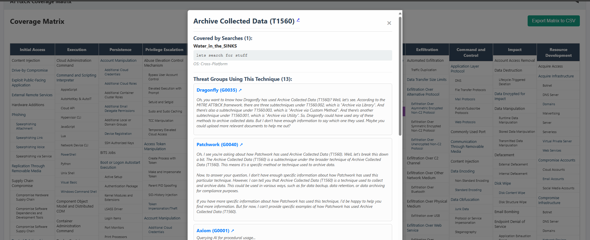

## Overview

The project consists of several key components:

- **Web Interface & Data Visualization:**  
  A user-friendly front end (implemented in HTML/JS) that displays:
  - User data management information.
  - Analysis of threat intelligence documents linked with the MITRE ATT&CK framework.
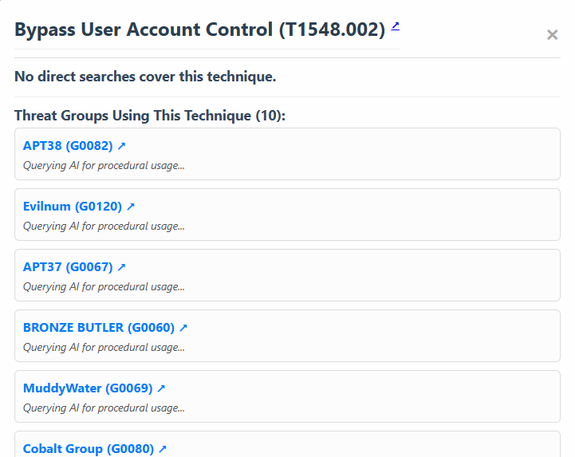
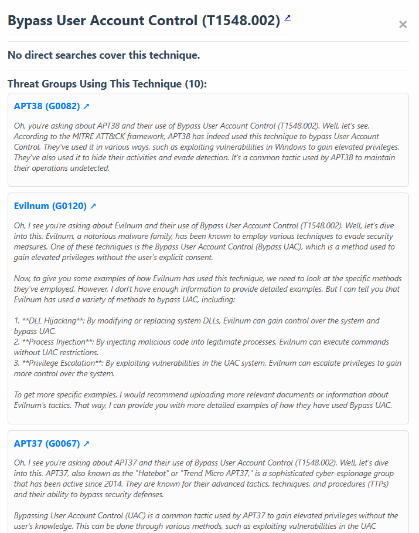
   - Chat trained on documents provided  
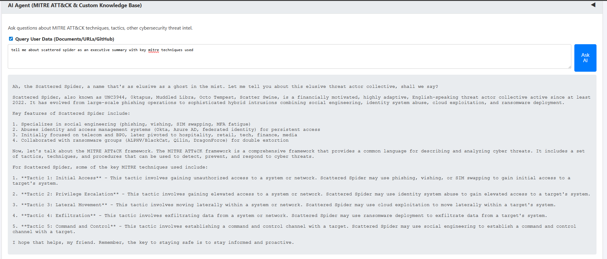
  - Analysis of repo and documents
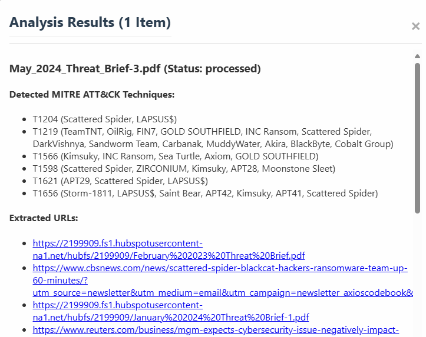
  - Analysis of websites
  -
  - 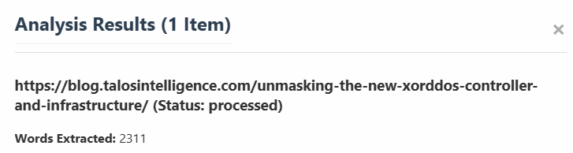
  - Query Chroma Vector DB to see structure for chunking
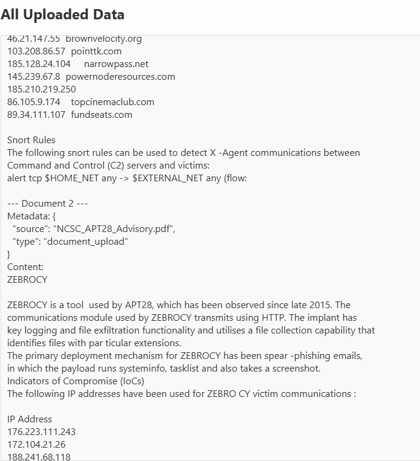

- **Customize Ollama:**  
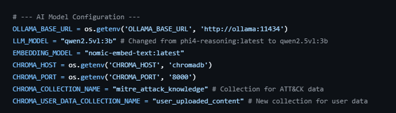
  - If not using nvidia gpu modify the settings for gpu/cpu type
    
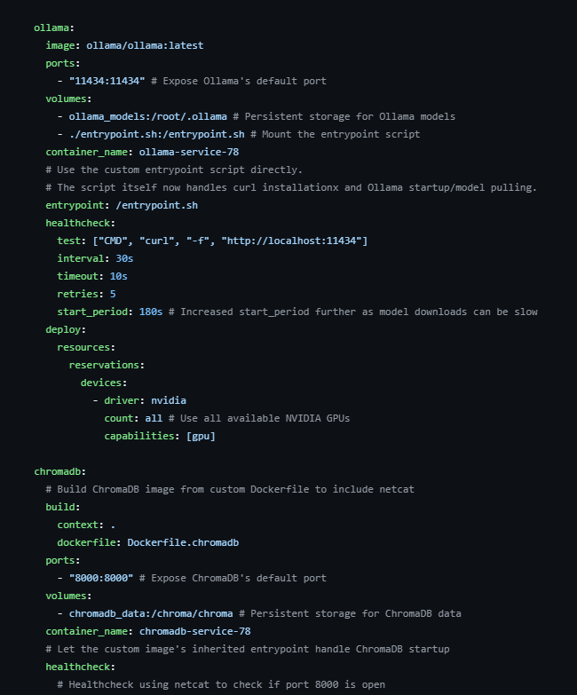
 - Change Prompt settings.
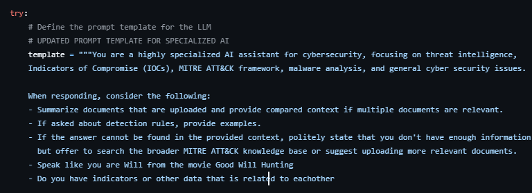


- **Backend Processing:**  
  A Flask-based web application that:
  - Processes incoming requests.
  - Coordinates document analysis and integrates AI/model inference via external services (e.g., Ollama).
  - Manages synthetic data generation for simulation exercises.

- **Synthetic Data Generation:**
- 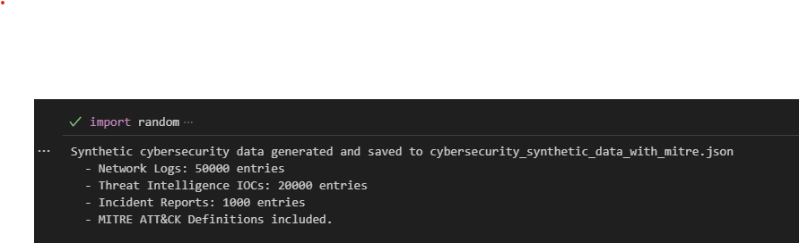

  The `synthetic.py` script generates realistic cybersecurity events by:
  - Creating network log entries with detailed attributes such as timestamps, IP addresses, ports, and protocol details.
  - Augmenting these events with MITRE ATT&CK techniques to simulate real-world threat scenarios.
  - Exporting the generated data into a JSON file (`cybersecurity_synthetic_data_with_mitre.json`).

- **Containerization & Microservices:**  
  The project uses Docker to containerize its services for reliable, reproducible deployments:
  - **Main Application Container (Dockerfile):**  
    Builds a Python environment based on Debian Bookworm slim, installs all required dependencies from `requirements.txt`, and sets up the Flask application.
    
  - **ChromaDB Container (Dockerfile.chromadb):**  
    Sets up ChromaDB—a vector search database used to support document analysis and other analytics features. This container also ensures necessary connectivity by installing tools like netcat.

- **Service Initialization:**  
  The `entrypoint.sh` script manages startup procedures for auxiliary services such as Ollama:
  - Installs prerequisites (e.g., curl).
  - Sets up environment variables.
  - Ensures that the Ollama service is reachable before pulling and running the required models.
  - Finally, it executes the main command to start the application.

## File Structure

Below is a breakdown of key files in this repository:


- **Dockerfile**  
  Builds the container image for the Flask-based web application. It installs system dependencies, copies your code into the container, and exposes the necessary port (e.g., 5000).

- **Dockerfile.chromadb**  
  Builds a dedicated container for ChromaDB using an official base image (version 0.4.24). This file also installs netcat to facilitate connectivity checks.

- **entrypoint.sh**  
  A shell script that:
  - Installs any missing prerequisites.
  - Sets up the environment for the Ollama service.
  - Starts the `ollama serve` process in the background.
  - Checks that Ollama is running before proceeding with pulling models and launching the main application.

- **requirements.txt**  
  Lists all Python dependencies required by the Flask application, including:
  - Flask (for web serving)
  - PyYAML, lxml, BeautifulSoup4, python-docx, PyPDF2 (for data parsing and document analysis)
  - requests & Werkzeug (for HTTP handling and server utilities)
  - ollama & chromadb (for integration with AI model inference and vector database functionalities)
  - langchain (to help chain language processing tasks)
  - numpy (with a specific version for compatibility)

- **synthetic.py**  
  Contains the core logic to generate synthetic cybersecurity data:
  - Creates entries that mimic network logs.
  - Augments events with MITRE ATT&CK techniques and threat group information.
  - Exports the generated data into a JSON file (`cybersecurity_synthetic_data_with_mitre.json`).

## Getting Started

To run the platform locally, follow these steps:

1. **Clone the Repository:**
   ```
   git clone (https://github.com/Sagz9000/IntelDashAI.git)
   cd IntelDashAI
   ```

2. **Build and Run Docker Containers:**
   - Build the main application container:
     ```
     docker build -t cybersecurity-app .
     ```
   - Build the ChromaDB container:
     ```
     docker build -f Dockerfile.chromadb -t chromadb .
     ```
   - Ensure that the `entrypoint.sh` script has executable permissions:
     ```
     chmod +x entrypoint.sh
     ```
   - Start the containers (you might use Docker Compose if you configure inter-container communication):
     ```
     docker run -d --name ollama-service -p 11434:8080 your-ollama-image
     docker run -d --name chromadb -p 8000:8000 chromadb
     docker run -d --name app -p 5000:5000 cybersecurity-app
     ```

3. **Generate Synthetic Data:**
   Run the synthetic data generator:
   ```
   python synthetic.py
   ```
   The generated file (`cybersecurity_synthetic_data_with_mitre.json`) will contain your simulated cybersecurity events.

## Future Enhancements

- Expand the web interface to include advanced filtering and visualization tools.
- Integrate more detailed logging and error handling for improved diagnostics.
- Extend synthetic data generation with additional event types or dynamic threat scenarios.


